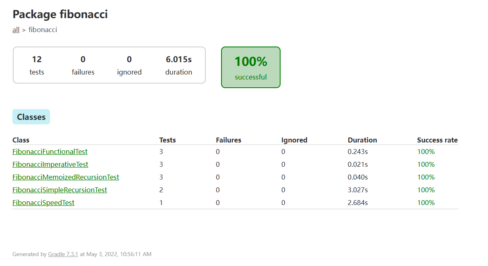

# Fibonacci using Test-Driven Development

## Contents

这个repo记录Java语言下使用测试驱动开发(Test-Driven Development, TDD) 来实现4种斐波那契函数。从零到一，自己独立构思设计。这是 [Dr. Venkat Subramaniam](https://agiledeveloper.com/aboutus.html) 2022年Software Design 课程的一部分，老师亲自进行Code Review。

**任务** 

Fibonacci函数的4种实现方式：

- 命令式
- 函数式
- 普通递归
- 记忆化递归

其中，记忆化递归需要复用普通递归的代码，并且测试记忆化递归比普通递归执行速度快。

**设计要求**

- 好的代码质量

- 轻量化设计

- 最少的代码
- 自动测试
- 代码覆盖
- 持续集成
- 尽可能地复用代码

## What You Can Learn

**可学习到的技术**

测试驱动开发(TDD), 自动化测试(CT)，持续集成(CI)，敏捷开发(Agile)，使用Jacoco查看代码coverage，使用pmd进行静态代码检查等。


**可学习到的设计原则**

单一职责原则(SRP), 别重复原则(DRY), 开闭原则(OCP), 依赖倒置原则(DIP)等。


## English Version


>The Fibonacci series of numbers start with 1, 1, 2, 3, 5, 8, 13, 21, ... where values at position 0 and 1 are 1, and values at each position after that are a sum of values at the previous two positions.
>
>Write four implementations of a function to compute the Fibonacci number at a given position.
>
>Please start with one implementation at a time rather than rushing through all of them at the same time.
>
>The four implementations are described below:
>
>1. An imperative iteration. Given a position n, loop through totaling values until you reach the value for the given position.
>2. A functional iteration. Given a position n, loop through totaling values until you reach the value for the given position. Avoid explicit mutability.
>3. A simple recursion. Given a position, compute the value at a position using the expression fib(n - 1) + fib(n - 2).
>4. A memoized recursion. Given a position, look up to see if the value has been precomputed and if so return that value. Otherwise, use recursion to compute the value.
>
>Confirm that the memoized version is faster than the recursive version.
>
>Reuse as much code as possible.
>
>Please bring forward the practices, techniques, and tools you have learned so far. This includes: Good code quality Lightweight design Minimum code Automated testing
>Code coverage Continuous integration
>
>Once you complete coding, please answer the following:
>
>1. What design principles did you use in this assignment? Discuss.
>
>YOUR RESPONSE GOES HERE
>
>1. Any surprises or things that you did not expect?
>
>YOUR RESPONSE GOES HERE


## Results

Result of tests



Result of Jacoco


## Structure

在TDD_Fibonacci文件夹下，有如下的主要文件：

```bash
Fibonacci/
├── src
│   └── fibonacci
│       ├── Fibonacci.java
│       ├── FibonacciFunctional.java
│       ├── FibonacciImperative.java
│       ├── FibonacciMemoizedRecursion.java
│       └── FibonacciSimpleRecursion.java
└── test
    └── fibonacci
        ├── FibonacciFunctionalTest.java
        ├── FibonacciImperativeTest.java
        ├── FibonacciMemoizedRecursionTest.java
        ├── FibonacciSimpleRecursionTest.java
        ├── FibonacciSpeedTest.java
        └── FibonacciTest.java

conf/: pmd进行静态代码检查的规则

tests.txt: 各种要进行的测试

build.gradle.kts: gradle自动构建的脚本(kotlin)
```


## Requirements

```
Java 8 及以上: 需要支持lambda表达式
Junit5: Unit test
gradle: 4.4.1 及以上
```


## Run

clone这个repo

```bash
https://github.com/shizhengLi/TDD_Fibonacci.git
```

运行构建

```bash
cd TDD_Fibonacci/TDD_Fibonacci
./gradlew
```

查看code coverage在：`/TDD_Fibonacci/build/reports/jacoco/test/html/index.html` （注：先构建之后才能出现build文件夹）
